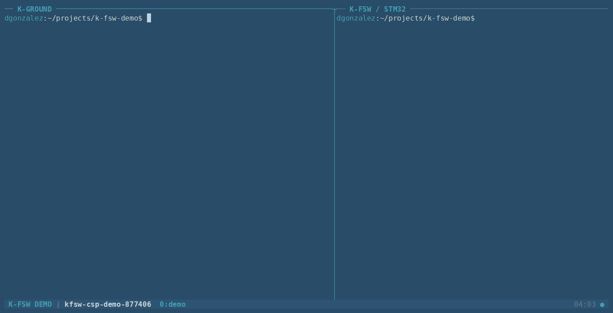
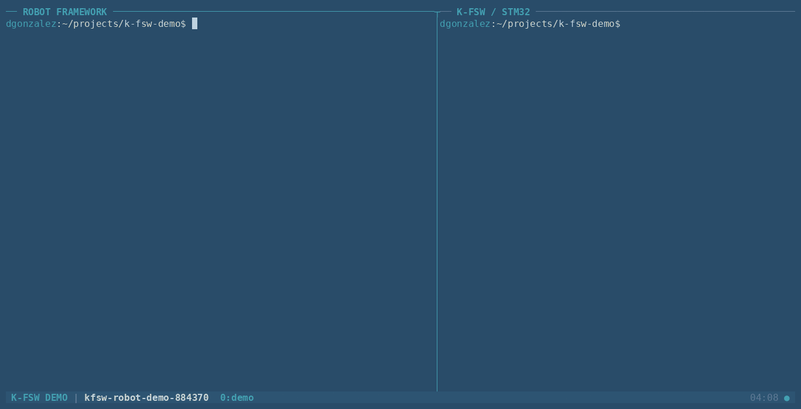
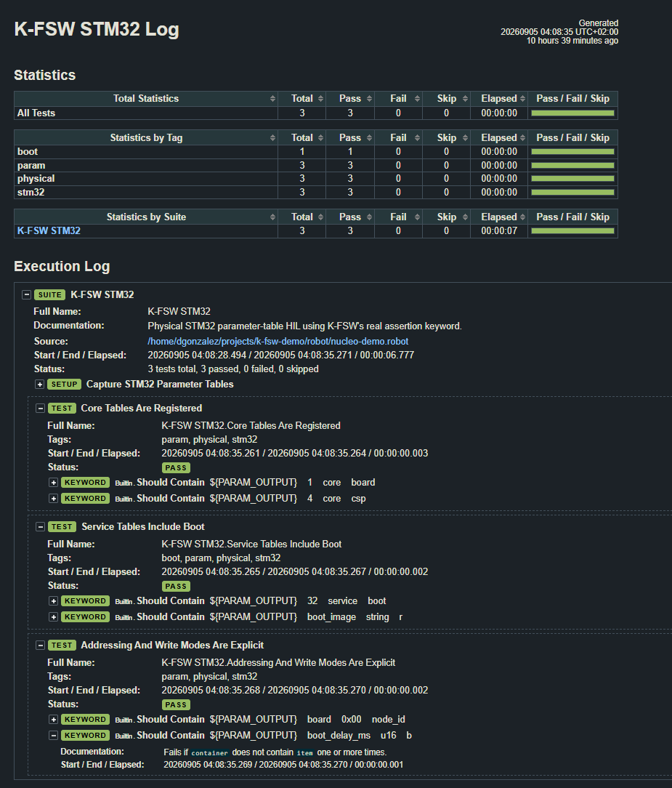

# K Flight Software — K-FSW

[](https://github.com/dgonzalez97/k-fsw/actions/workflows/ci.yml)
[](https://dgonzalez97.github.io/k-fsw/)

K-FSW is an open-source flight-software framework for small satellites, built
on Zephyr. It gives a spacecraft the things every mission needs before it can
do anything mission-specific: a console, a link to the ground, named settings
you can read and change from that link, files, events, commands, a watchdog,
and a way to replace the running image.

The full composition runs in native simulation and on a NUCLEO-L496ZG. The
parameter tables, file transfer, commands, events and a firmware update have
all been exercised on that board from a ground node over a radio link, not only
in simulation. What has and has not been proven on hardware is tracked in the
[project status](docs/status/index.md).

[Read the documentation](https://dgonzalez97.github.io/k-fsw/) for setup,
architecture, operations, testing, and the C API.

## Modules

The framework is meant to be composed, not forked. A module is the code that
knows about one piece of hardware; everything underneath it is generic and
stays that way.

```text
app         composition: targets, tables 1-24, shell adapters
 └── modules      hardware: radio-uhf, hw_test        tables 50-99
      └── services   log, param, files, events, commands, health, update
           └── comms    CSP lifecycle, routing, UART/KISS
                └── platform   time, storage, reset cause, watchdog
```

The direction is one-way. A layer never includes a header from a layer above
it, which is why the core parameter tables live in the composition: `platform`
and `comms` sit below the parameter service and must not depend on it.

A module owns its hardware, its public interface, its parameters and what they
mean, its shell command and its tests. It does not own the mechanisms it uses
to reach that hardware — the UHF radio moves bytes over a serial link without
taking UART, KISS, CSP or routing with it.

Adding one touches no shared registry. A module claims a table number in the
50–99 band, defines its own values at whatever offsets it likes inside that
table, and hands the composition a definition set. Nothing in the parameter
service changes, and the module never learns that CSP exists.

Two exist today, both in
[`kfsw-modules`](https://github.com/dgonzalez97/kfsw-modules):

| Module | Table | What it is |
| --- | --- | --- |
| `radio-uhf` | 50 | UHF equipment, with a Holybro SiK implementation |
| `boton-test` / `hw_test` | 67 | A worked example: debounced button, three LEDs, small enough to read in one sitting |

## Firmware update

A node can be given a new image over the same radio it uses for everything
else. This is the whole path — send, flash, reboot, confirm:



The image is streamed into the secondary slot at the swap offset, checked
against a whole-image CRC32, and only then handed to the bootloader. Two routes
exist: one over the file-transfer service, and a direct block protocol with
per-block checksums and repeat, for links where a long stream will not survive
in one piece.

**Receiving and committing are separate steps.** A transfer stops at a verified
image and stays there until something tells it to flash. An image that arrived
intact is not the same thing as an image you want to boot.

MCUboot does the rest: it checks the signature, boots the new image, and
reverts to the previous one if nothing confirms the new image is working. A bad
upload costs a reboot, not the spacecraft. K-FSW adds no authenticity of its
own beyond that signature, one transfer runs at a time, and the ground has to
hold the image it wants to send.

Recorded on hardware: a signed image sent from a ground node to a NUCLEO over a
Holybro pair, the node rebooting into it, and `mcuboot confirm` marking it
good. The evidence is not that the transfer succeeded — the two images differ
only in the revision they report, so a node answering with the new revision is
running code that arrived over the air.

## Everything else

- **Parameters you can reach from the ground.** Named values in tables,
  addressed by table and offset, carrying scalars, strings and byte arrays —
  100 of them across 16 tables in the full composition, fewer when a
  composition enables less. Each is owned by the code it describes, which
  validates a write before it lands and decides what a change means.
- **CSP over a radio.** libcsp routing with independently named UART/KISS
  interfaces, static routes, and RDP where a stream needs it.
- **Files.** LittleFS storage, and transfers in either direction with a whole
  file CRC32 checked before anything is committed.
- **Commands, events and health.** A command service with typed arguments and
  results, a bounded event record with stable identifiers, and a watchdog fed
  by a health policy rather than by a timer.
- **Ground nodes.** `k-ground` builds Linux CSP nodes for the other end of the
  link, so a two-node setup needs one board rather than two.

## Try it

From a configured west workspace root:

```bash
west manifest --validate
./k-fsw/tools/kfsw-linux build
./k-fsw/tools/kfsw-linux run
```

That gives you a shell:

```text
kfsw:~$ status
kfsw:~$ param tables
kfsw:~$ param table 1
kfsw:~$ storage info
```

`param tables` lists what this node carries, and `param table <id>` prints one
of them. Add a node number to either — `param table 2 1` — to read the same
thing from across a link.

To bring up the other end of a link, in two more terminals:

```bash
./k-fsw/tools/k-ground init
./k-fsw/tools/k-ground run kfsw-gnd-uhf
```

```bash
./k-fsw/tools/k-ground run kfsw-ops
```

`csp ping 16` from the operator node checks the local link. The
[ground guide](docs/ground/index.md) covers the configuration model, the other
reserved roles, and where the radio bench begins.

## Targets

| Target | Zephyr board | What runs on it |
| --- | --- | --- |
| `linux` | `native_sim/native/64` | Everything, over a simulated PTY |
| `nucleo_l496zg` | `nucleo_l496zg` | Everything, over USART3 |

Two more boards run a shell and nothing else. They are bring-up profiles, not
flight targets, and they build without CSP, parameters, storage or files:

| Target | Zephyr board | Verified scope |
| --- | --- | --- |
| `frdm_k64f` | `frdm_k64f/mk64f12` | OpenSDA UART shell |
| `rpi_pico_w` | `rpi_pico/rp2040/w` | USB CDC ACM shell |

## Testing

Testing is split by what a test can honestly prove, and nothing that needs
hardware ever runs by accident.

### On every push and pull request

Eight jobs, all of which must pass before anything merges:

| Job | What it checks |
| --- | --- |
| `BUILD / linux`, `BUILD / nucleo_l496zg` | Both full targets build, plus a CSP-disabled composition |
| `QUALITY` | clang-format and cppcheck over the sources |
| `UNIT / Twister` | **184 cases** across 16 suites |
| `INTEGRATION / software` | 18 end-to-end smoke scripts driving a real image |
| `MEMORY / Valgrind` | The hosted image under Valgrind |
| `ROBOT / dry-run + software` | Every suite parses; the software-tagged cases run |
| `DOCS / Doxygen` | The documentation builds and the API is documented |

The unit suites cover each layer on its own — `services_param`,
`services_param_strings`, `services_command`, `services_event`,
`services_health`, `services_ftp`, `services_fwu`, `services_fwu_lite`,
`comms_csp`, `comms_routing`, `platform_storage`, `platform_watchdog` and the
rest. The integration scripts go the other way: they boot a real image and talk
to it the way an operator would.

### Hardware in the loop

Robot Framework drives the physical suites. A HIL run is a sequence of operator
actions, and Robot is honest about which ones passed:

| Suite | Needs | Covers |
| --- | --- | --- |
| `tests/hil/boot.robot` | NUCLEO | Boot markers and reset cause |
| `tests/hil/uart.robot` | NUCLEO | Shell and CSP over the debug UART |
| `tests/hil/param-tables.robot` | NUCLEO | Every table present and addressed, with the right write modes |
| `tests/hil/holybro.robot` | NUCLEO + radio pair | CSP, files, commands and events across the link |
| `tests/hil/fwu.robot` | NUCLEO + radio pair | An image sent, flashed and booted |
| `tests/hil/terminal.robot` | — | The software-tagged operator scenarios |

Cases are tagged `physical` where they need the board, so the same files run in
CI with hardware excluded and on the bench with it connected:

```bash
./k-fsw/tests/hil/run.sh --exclude physical    # what CI runs
./k-fsw/tests/hil/run.sh                       # the bench, board attached
```

The parameter-table suite running against a NUCLEO:



And the report it leaves behind — three physical cases, tagged `param`, `boot`
and `stm32`, each naming the table it read:



A physical result is only ever recorded when someone watched it happen. The
[testing guide](docs/testing/index.md) has the full matrix, and the
[project status](docs/status/index.md) separates what exists from what has been
tested in software and what has been read off a board.

## Layout

`k-fsw` composes the application and owns the targets, tools, integration
tests and documentation. Reusable code lives in four repositories, pinned by
[`west.yml`](west.yml) and tested together by this repository's CI.

| Repository | Owns |
| --- | --- |
| [`k-fsw`](https://github.com/dgonzalez97/k-fsw) | Composition, targets, tools, integration tests, docs, CI |
| [`kfsw-platform`](https://github.com/dgonzalez97/kfsw-platform) | Zephyr-facing mechanisms: time, storage, reset cause, watchdog |
| [`kfsw-services`](https://github.com/dgonzalez97/kfsw-services) | Logging, parameters, persistence, files, events, commands, health, firmware update |
| [`kfsw-comms`](https://github.com/dgonzalez97/kfsw-comms) | CSP lifecycle, routing, UART/KISS transports |
| [`kfsw-modules`](https://github.com/dgonzalez97/kfsw-modules) | Device and subsystem modules: `radio-uhf`, the `hw_test` example |

## Development

The software-only CI sequence, from the workspace root:

```bash
./k-fsw/tools/ci/all.sh
```

Documentation:

```bash
./k-fsw/tools/docs/build.sh     # HTML into build/docs/html/
./k-fsw/tools/docs/serve.sh
```

A printable guide, after installing its Python requirements:

```bash
./.venv/bin/pip install -r k-fsw/docs/pdf/requirements.txt
./k-fsw/tools/docs/pdf.sh       # build/k-fsw-guide.pdf
```

The [development guide](docs/development/index.md) covers contributions and how
a change spanning several pinned repositories is landed.

## Related work

K-FSW is not the only open-source flight software built on Zephyr, and these
are worth knowing about:

- [scsat1-fsw](https://github.com/spacecubics/scsat1-fsw) — Space Cubics' flight
  software for SC-Sat1, also Zephyr and also CSP, flown rather than
  bench-tested. Their
  [board documentation](https://docs.spacecubics.com/scobc-a1-ja/latest/software/use-zephyr-drivers/gpio.html)
  is a good model for writing up how a driver is actually wired in.
- [RDFM](https://github.com/antmicro/rdfm) — Antmicro's over-the-air update and
  fleet-management framework, with a Zephyr client. It solves the update
  problem at a fleet scale that K-FSW's single-image path does not attempt.
- [Yamcs](https://yamcs.org/) — mission control that speaks to a spacecraft
  rather than a shell, used by
  [scsat1-mcs](https://github.com/spacecubics/scsat1-mcs). It is where the
  ground side of K-FSW would go beyond a console.
