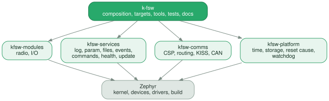
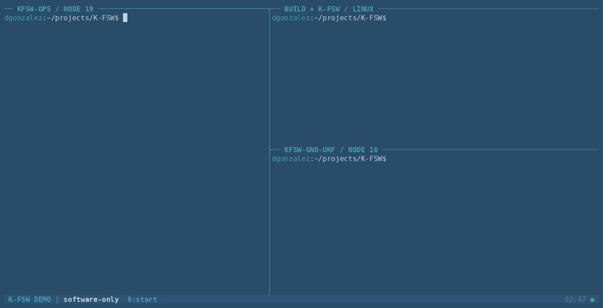
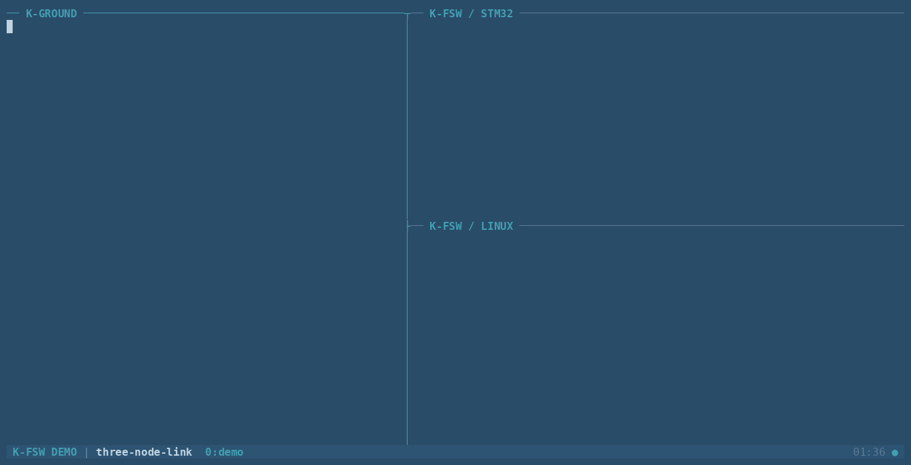

# K-FSW - Flight Software for Next Space

[](https://github.com/dgonzalez97/k-fsw/actions/workflows/ci.yml)
[](https://dgonzalez97.github.io/k-fsw/)

Open-source flight software built on Zephyr, for small satellites and Cubesats.

It gives a spacecraft what every mission needs before it can do anything
mission-specific: a console, a link to the ground, settings you can read and
change over that link, files, events, logs, commands, housekeeping, and a firmware update mechanism over the air. 


It is written with on-board computers in mind, but can be used for anything in a spacecraft. Because it
is composed rather than hardcoded, the same framework runs on a radio, ADCS, an EPS or
any other board with a processor: you enable what that subsystem needs and leave
the rest out.

[Read the documentation](https://dgonzalez97.github.io/k-fsw/) for setup,
architecture, operations, testing, and the doxygen for the C API.

## Layout of K-FSW




| Repository | Owns |
| --- | --- |
| [`k-fsw`](https://github.com/dgonzalez97/k-fsw) | Composition, targets, tools, integration tests, docs, its the main app |
| [`kfsw-modules`](https://github.com/dgonzalez97/kfsw-modules) | Device and subsystem modules |
| [`kfsw-services`](https://github.com/dgonzalez97/kfsw-services) | Logging, parameters, persistence, files, events, commands, health, firmware update |
| [`kfsw-comms`](https://github.com/dgonzalez97/kfsw-comms) | CSP, routing, UART/KISS and CAN transports |
| [`kfsw-platform`](https://github.com/dgonzalez97/kfsw-platform) | Zephyr mechanisms: time, storage, reset cause, watchdog, I/O |


## Modules

A **module** only knows about one piece of hardware - a radio, a sensor, a subsystem. It
owns its own interface, its parameters, its shell command and its tests.

Adding one touches nothing shared. A module claims its own block of settings
and hands them to the composition, so no existing file changes and the module
never has to learn about the services.

Examples in  [`kfsw-modules`](https://github.com/dgonzalez97/kfsw-modules):
a UHF radio, and a small worked example using LEDs and buttons of development boards.

## What KFSW does

- **Settings you can change from the ground.** 113 named values in 17 tables,
  each owned by the code it describes, which checks a write before it lands. Can be persisted for reboots, and use a system that makes V&V life easier.
- **CSP.** One router, and a route decides which link a destination takes,
  over [libcsp](https://github.com/libcsp/libcsp).
- **Files** in either direction, checksummed before anything is committed.
- **[Firmware update](#firmware-update) over the air**, with rollback if the
  new image never confirms itself. Two routes: a light block protocol, and one
  over file transfer.
- **Commands, events and health.** A node can be told to do something and
  answer whether it worked, keep a record of what it did while nobody was
  listening, and reset itself when a part of it stops responding.
- **Housekeeping.** Name a set of values once, and a pass asks for the set
  rather than its members. Reading 113 parameters one round trip at a time is
  the difference between knowing how a spacecraft is and guessing.
- **Ground nodes.** The ground segment lives in this same workspace, built from
  the same sources as the flight side, as if it was one extra node on the satelite.
## Using KFSW
The first demo tries to get you to talk between nodes without any hardware at all (
every node here is a Linux process, and they reach each other over
pseudo-terminals exactly as they would over a radio, kiss or CAN )



```bash
west manifest --validate
./k-fsw/tools/kfsw-linux build
./k-fsw/tools/k-ground init   
```

Then, in other terminal:

```bash              
./k-fsw/tools/k-ground run kfsw-gnd-uhf 
./k-fsw/tools/kfsw-linux run     
```


`csp ping 16` from the operator node crosses the link and comes back. The
[ground guide](docs/ground/index.md) covers the configuration enviroment and the
other ground roles.


### Settings and configuration, across all nodes

`param tables` lists the table from every node and `param table <id>` prints one.

Reaching them from the ground is a separate, optional piece that speaks
[Space Inventor's libparam](https://github.com/spaceinventor/libparam).




### Files

Up, checked on the node, back down, and compared.The CRC32 of the file is what makes it a round trip. RDP can be activated for loss-less connections, and files that stop while being sent, generate a .map file that can be reused, on links that may loss connection.


### Firmware update
send, flash, reboot, confirm. An image that arrives
intact is not the same as one you want to boot, so receiving and committing are
separate steps, and MCUboot puts the old image back if the new one never
confirms itself.
A recovery image, (with minimal modules, flashed in protected memory) can be configured to be the fallback of the A/B images, in the cathastrophic case that 2 main images are failing.


## Hardware

The board in use today is an **STM32 Nucleo (L496ZG)**, and several more will
join it before the first release, if they are supported by the Zephyr Proyect. Parameter tables, file transfer, commands, events, CAN and a firmware update have all been exercised on it from a ground node over a real radio link, but also in simulation.

What has and has not been proven on hardware is tracked in the
[project status](docs/status/index.md).

## Targets
 
| Target | Board | Links | What runs on it |
| --- | --- | --- | --- |
| `linux` | `native_sim/native/64` | KISS over a PTY, CAN via SocketCAN | Everything |
| `nucleo_l496zg` | STM32 Nucleo L496ZG | KISS on USART3, CAN on PD0/PD1 | Everything |

They are bring-up profiles, not
flight targets, and build without CSP, parameters, storage or files, to test Zephyr. TBD before release to test them as well.

| Target | Board | Verified scope |
| --- | --- | --- |
| `frdm_k64f` | `frdm_k64f/mk64f12` | OpenSDA UART shell |
| `rpi_pico_w` | `rpi_pico/rp2040/w` | USB CDC ACM shell |

## Testing

Nine jobs run on every push, and all must pass before anything merges:

| Job | What it checks |
| --- | --- |
| `BUILD / linux`, `BUILD / nucleo_l496zg` | Both full targets build, plus a CSP-disabled composition |
| `QUALITY` | clang-format and cppcheck over the sources |
| `UNIT / Twister` | **227 cases** across 23 suites |
| `INTEGRATION / software` | 18 end-to-end smoke scripts driving a real image |
| `MEMORY / Valgrind` | The hosted image under Valgrind |
| `UNDEFINED / UBSan` | The same suites, watching the arithmetic rather than the memory |
| `ROBOT / dry-run + software` | Every suite parses; the software-tagged cases run |
| `DOCS / Doxygen` | The documentation builds and the API is documented |

The unit suites cover each layer on its own; the integration scripts go the
other way, booting a real image and talking to it through a ground node the way
an operator would.

[Coverage is reported by Twister](https://dgonzalez97.github.io/k-fsw/coverage/),
which builds the suites instrumented, runs them and composes the report. Lines,
functions and branches are each reported per file, down to the source itself,
and every function is listed with the number of times it ran. It measures the
unit suites only, so a low figure means a layer is tested mostly on a bench
rather than that it is untested.

### Hardware in the loop

[Robot Framework](https://robotframework.org/) drives the physical suites,
because a HIL run is a sequence of operator actions and Robot is honest about
which ones passed.

It reaches the boards through
[`robot-terminal-runner`](https://github.com/dgonzalez97/robot-terminal-runner)
[](https://github.com/dgonzalez97/robot-terminal-runner/actions/workflows/ci.yml),
which attaches Robot to a [tmux](https://github.com/tmux/tmux) session and
types into it. It is a submodule under `tests/platform`.

So the session a person would drive by hand is the one the suite drives. A case
is a recording of operator actions rather than a harness that has to resemble
one, which is what makes it easy to read and edit for V&V.

| Suite | Needs | Covers |
| --- | --- | --- |
| `boot`, `uart` | Nucleo | Boot markers, reset cause, shell and CSP over the debug UART |
| `param-tables` | Nucleo | Every table present and addressed, with the right write modes |
| `can` | Nucleo + CAN adapter | CSP over CAN: ping, identity and remote settings |
| `holybro` | Nucleo + radio pair | CSP, files, commands and events across the link |
| `fwu` | Nucleo + radio pair | An image sent, flashed and booted |

Cases needing the board are tagged, so the same files run in CI without
hardware and on the bench with it. The [testing guide](docs/testing/index.md)
has the full matrix and how to run them.

The parameter-table suite running against the Nucleo over CAN and RF.


And the report it leaves behind:


A physical result is only ever recorded when someone watched it happen. The
[project status](docs/status/index.md) separates what exists from what has been
tested in software and what has been read off a board.

## Development


The [documentation site](https://dgonzalez97.github.io/k-fsw/) covers setup,
architecture, operations and the C API, and the same content builds as a
printable guide with 

`./k-fsw/tools/docs/pdf.sh`. 

The [development guide](docs/development/index.md) covers contributions and how to add modules or
changes. 
