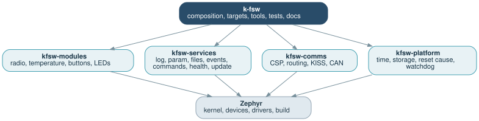
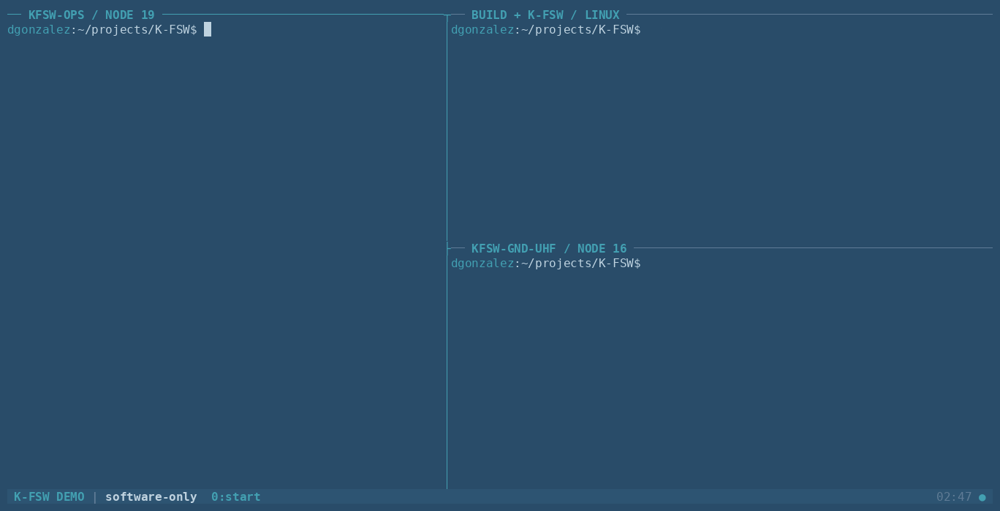
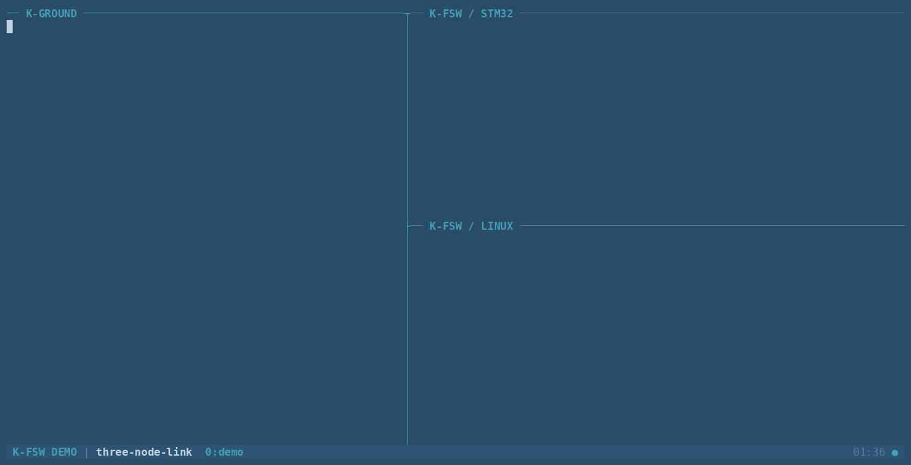
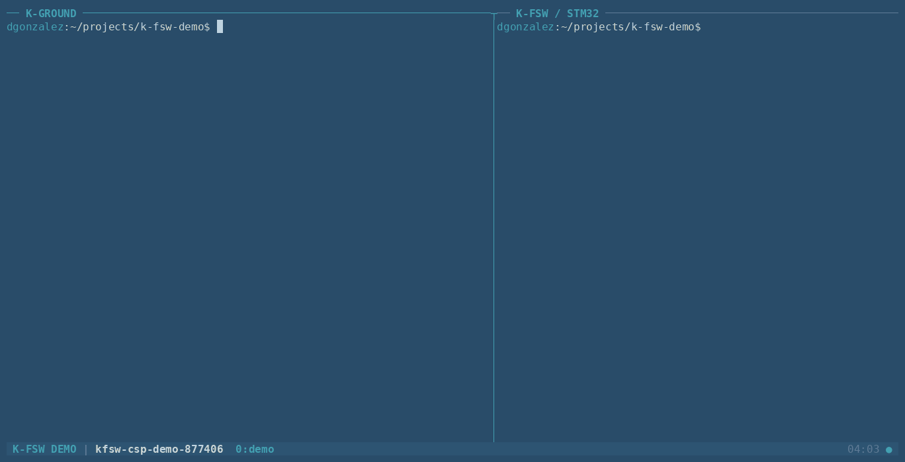
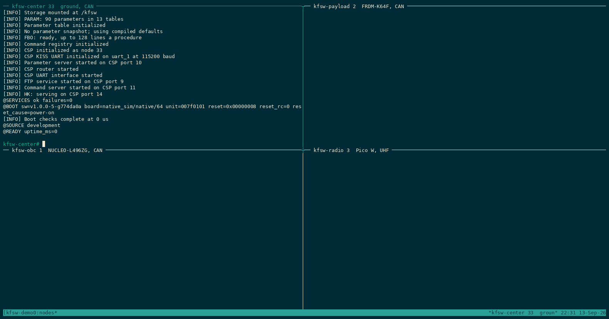
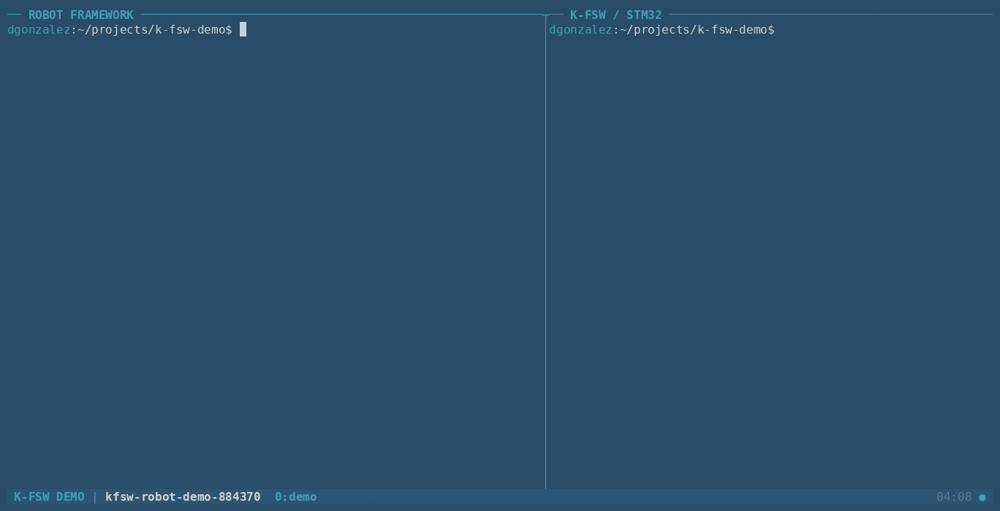
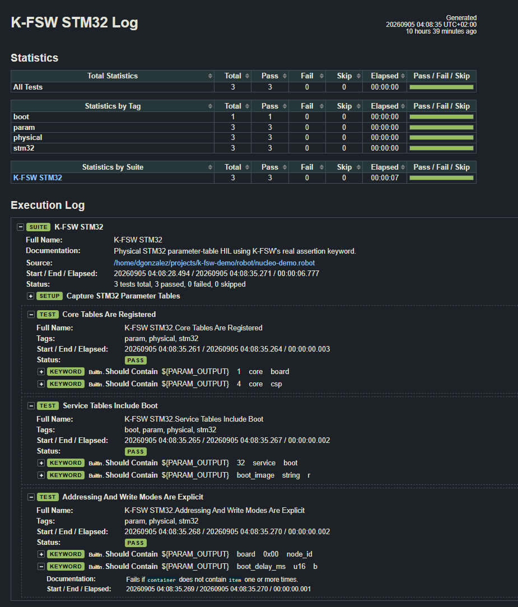

<p align="center"></p>

# K-FSW (KFSW): modular flight software on Zephyr, for small satellites

[](https://github.com/dgonzalez97/k-fsw/actions/workflows/ci.yml)
[](https://dgonzalez97.github.io/k-fsw/)

K-FSW gives spacecraft components the common services a mission needs:
a console, ground links, parameters, files, logs, events, commands,
housekeeping, and firmware updates. Select what an OBC, radio, ADCS, EPS,
or payload needs, then only add the mission-specific code.

Zephyr supplies the RTOS, drivers, board support, and build tools, so the
application can run on different MCU vendors and in Linux simulation.
Modules and services can be reused in another RTOS port by adapting the
Zephyr APIs they use.

[Documentation](https://dgonzalez97.github.io/k-fsw/) |
[Getting started](docs/getting-started/index.md) |
[Shell commands](docs/commands/index.md) |
[Project status](docs/status/index.md)

## Repository layout



| Repository | Contents |
| --- | --- |
| [`k-fsw`](https://github.com/dgonzalez97/k-fsw) | Application, targets, tools, integration tests, docs |
| [`kfsw-modules`](https://github.com/dgonzalez97/kfsw-modules) | Device and subsystem modules |
| [`kfsw-services`](https://github.com/dgonzalez97/kfsw-services) | Logging, parameters, persistence, files, events, commands, health, firmware update |
| [`kfsw-comms`](https://github.com/dgonzalez97/kfsw-comms) | CSP, routing, UART/KISS and CAN transports |
| [`kfsw-platform`](https://github.com/dgonzalez97/kfsw-platform) | Zephyr mechanisms: time, storage, reset cause, watchdog, I/O |

## Modules

A module defines one device or subsystem: its interface, state, parameters,
and tests. The parameter core does not need to change.

Examples in [`kfsw-modules`](https://github.com/dgonzalez97/kfsw-modules):
a UHF radio, board buttons and LEDs, and an MCU temperature sensor.

## Services

- **Parameters:** named values with validation, remote access, callbacks and optional persistence.
- **CSP:** communications router, with routes selecting UART/KISS or CAN links.
- **Files:** upload, download, list and create directories, with CRC32 and RDP.
- **Firmware update:** binaries over FTP, with MCUboot test,
  confirm, and rollback. FWU lite sends blocks over CSP without a filesystem.
- **Commands and events:** a shell and remote commanding.
- **Health:** component deadlines, control and watchdog.
- **Housekeeping:** collect groups of parameters and forward telemetry to Yamcs.
- **Ground nodes:** the same application and services built for Linux.

## KFSW on Linux

The local demo connects Linux nodes using CSP/KISS.



```bash
west manifest --validate
./k-fsw/tools/kfsw-linux build
./k-fsw/tools/k-ground init
```

```bash
./k-fsw/tools/k-ground run kfsw-gnd-uhf
```

```bash
./k-fsw/tools/k-ground run kfsw-ops
```

Run `csp ping 16` from the operator node. The
[ground guide](docs/ground/index.md) covers the configuration and the
other ground roles.

### Parameters

`param tables` lists the tables, `param table <id>` prints one with its values
and `param list` prints every parameter. Put a node number first to ask
another node: `param tables 2`.

Remote access uses [Space Inventor's libparam](https://github.com/spaceinventor/libparam).



### Files

Uploads and downloads check size and CRC32 before committing the file.
RDP handles retransmission.


### Firmware update

Send a signed image over FTP or FWU lite, boot it, then confirm it. FTP uploads
to `/firmware.bin` schedule a test boot after verification. FWU lite
separates upload from `fwu flash`.

Golden-image selection is not implemented. See the [update guide](docs/fwu/README.md).



## Hardware

NUCLEO-L496ZG is the current MCU reference. Bench tests cover
parameters, files, commands, events, CAN, housekeeping, and firmware updates.
See [targets](docs/targets/index.md).

[Project status](docs/status/index.md) records tested configurations and limits.

## Targets

| Target | Board | Architecture | Links | What has been tested |
| --- | --- | --- | --- | --- |
| `linux` | `native_sim/native/64` | x86-64 host | KISS over a PTY; optional CAN via SocketCAN | Reference services and optional profiles |
| `nucleo_l496zg` | STM32 Nucleo L496ZG | Arm Cortex-M4 | KISS on USART3; optional CAN on PD0/PD1 | Reference services and optional profiles |
| `frdm_k64f` | NXP FRDM-K64F | Arm Cortex-M4 | OpenSDA UART console | Shell only; CSP, parameters, storage and file transfer are off |
| `rpi_pico_w` | Raspberry Pi Pico W | Arm Cortex-M0+ | USB CDC ACM console | Shell only; CSP, parameters, storage and file transfer are off |

### Identifying a board

The ID is shown by `status` and
`version`, and the ground can read it with `param get <node> hw_id`:

```text
@BOOT sw=v1.0.1 board=nucleo_l496zg/stm32l496xx unit=203037324d46500c0010001f ...
```



Here a ground node talks to an STM32 and a Kinetis over CAN, and to an RP2040
over a UHF radio.

## Mission control

[Yamcs](https://yamcs.org/) records housekeeping telemetry. The
[kfsw-yamcs](https://github.com/dgonzalez97/kfsw-yamcs) configuration is a
submodule under `ground-station/yamcs`:

```bash
cd ground-station/yamcs
./mvnw yamcs:run
```

The host bridge pulls housekeeping samples over CSP and forwards them to Yamcs.
Report definitions generate both the node configuration and the mission database.
Configure housekeeping through K-FSW commands.

The [ground guide](docs/ground/index.md) has a working demo.

## Testing

CI builds Linux and NUCLEO and runs unit, integration, Robot, memory, quality,
and documentation checks. From the workspace root:

```bash
./k-fsw/tools/ci/all.sh
```

Bench tests cover CAN, radio, parameters and firmware updates. Robot drives
the console and records the results; hardware cases are excluded from CI.

[Test commands and bench setup](docs/testing/index.md) |
[Coverage](https://dgonzalez97.github.io/k-fsw/coverage/)





## Development

Check the [contribution guide](docs/development/index.md).

## License

Licensed under [Apache 2.0](LICENSE). Third-party dependencies retain their
own licences.
