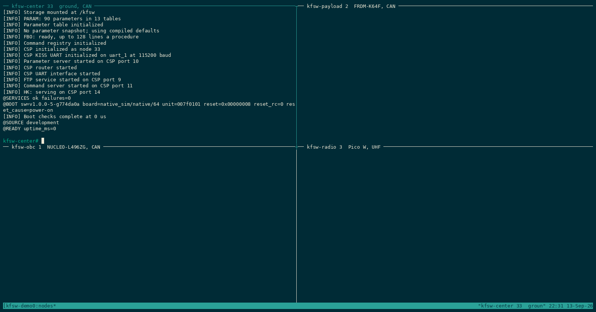

# Boards and targets {#targets}

[TOC]

## Boards and targets

A Zephyr board selects the SoC, devices and flash runner. A K-FSW target adds
the application configuration and tool defaults under `config/targets/`; for
example `rpi_pico_w` maps to `rpi_pico/rp2040/w`.

| Target | Zephyr board | Default composition | Tested |
| --- | --- | --- | --- |
| `linux` | `native_sim/native/64` | Shell, storage, parameters, persistence, CSP UART/KISS, remote parameters, FTP | Software tests in CI |
| `nucleo_l496zg` | `nucleo_l496zg` | Same as Linux; shell on ST-LINK, CSP on USART3 | CI build; boot, storage, UART/KISS, CSP, remote parameters and FTP on the bench |
| `frdm_k64f` | `frdm_k64f/mk64f12` | Shell only | Boot and shell on the board |
| `rpi_pico_w` | `rpi_pico/rp2040/w` | USB CDC ACM shell only | Boot and shell on the board |

Only Linux and the NUCLEO are built in CI.

## Identifying a unit

Every target reports its chip's unique ID: as `unit=` in the boot marker, in
`status` and `version`, and as `hw_id` in the board table. It is 96 bits on the
STM32L496, 128 on the Kinetis K64 and 64 on the RP2040. The CSP model is the
board target, so `csp ident` names the hardware too.



In this recording the FRDM and the Pico run bench configurations with CSP, on
CAN and behind a UHF radio. The `frdm_k64f` and `rpi_pico_w` targets in the
table are shell only.

## KFSW-Linux

KFSW-Linux is the application built for Zephyr's 64-bit native simulator. It
compiles the same sources as the NUCLEO build, on simulated devices. It is the
quickest target to test on, but it says nothing about MCU timing, electrical
behaviour, interrupt load or flash wear.

```bash
./k-fsw/tools/kfsw-linux build
./k-fsw/tools/kfsw-linux run
```

The executable is `build/linux/zephyr/zephyr.exe`, and the runner gives it
`build/linux/kfsw-storage.bin` as flash; tests use their own flash files. The
shell uses stdin/stdout. A line such as

```text
uart_1 connected to pseudotty: /dev/pts/...
```

is the CSP UART, not the console.

CI builds the target and a composition without CSP. Twister runs the unit
tests, the integration and Robot tests start one or two full processes, and
Valgrind checks a normal boot and one with a corrupted snapshot.
`tests/config/linux-node2.conf` configures the second test node.

## NUCLEO-L496ZG

The NUCLEO build enables storage, local and remote parameters, persistence,
CSP, UART/KISS and FTP. Flash is split into a 960 KiB application partition
and a 64 KiB LittleFS partition.

| Connection | Hardware | Use |
| --- | --- | --- |
| Debug console | ST-LINK virtual COM, LPUART1 | Shell, logs and boot markers |
| CSP link | USART3, PD8 TX and PD9 RX | 115200 8N1 KISS |

CSP reception is interrupt driven. The NUCLEO is node 2 and sends traffic for
every other node to the KISS interface.

### Button and LED example

`boton_test` is not in the default image. Build it with:

```bash
KFSW_EXTRA_CONF_FILE="$PWD/k-fsw/config/profiles/nucleo-boton-test.conf" \
KFSW_EXTRA_DTC_OVERLAY_FILE="$PWD/k-fsw/config/profiles/nucleo-boton-test.overlay" \
  ./k-fsw/tools/build.sh nucleo_l496zg
```

The overlay maps the USER button and the green, blue and red LEDs (LD1 to LD3)
to the module's chosen properties, so the pins stay in devicetree. The button
is debounced for 30 ms on the system workqueue, and its values are in table 67.
The manual test is in `tests/hil/boton-test/`.

### Wall clock

`csp clock set <seconds>` sets the wall time. Without an RTC the time is kept
in RAM and lost at reset, and samples collected after the reset have a zero
timestamp.

`config/profiles/nucleo-clock.conf` and `nucleo-clock.overlay` enable the RTC.
It runs from the low-speed oscillator, keeps counting across resets and
low-power states, and survives a power loss when VBAT is connected.

```bash
KFSW_EXTRA_CONF_FILE="$PWD/k-fsw/config/profiles/nucleo-clock.conf" \
KFSW_EXTRA_DTC_OVERLAY_FILE="$PWD/k-fsw/config/profiles/nucleo-clock.overlay" \
  ./k-fsw/tools/build.sh nucleo_l496zg
```

### Last words

`config/profiles/nucleo-lastwords.conf` keeps a short note across a restart and
watches the supply voltage, so a node can report why it went down.

### MCUboot

The bootloader is not in the default image. Build it with sysbuild:

```bash
KFSW_SYSBUILD=1 \
KFSW_MCUBOOT_KEY="$HOME/.config/kfsw/mcuboot-signing-key.pem" \
KFSW_EXTRA_CONF_FILE="$PWD/k-fsw/config/profiles/nucleo-mcuboot.conf" \
KFSW_EXTRA_DTC_OVERLAY_FILE="$PWD/k-fsw/config/profiles/nucleo-mcuboot-flash.overlay;$PWD/k-fsw/config/profiles/nucleo-mcuboot.overlay" \
KFSW_MCUBOOT_DTC_OVERLAY_FILE="$PWD/k-fsw/config/profiles/nucleo-mcuboot-flash.overlay" \
  ./k-fsw/tools/build.sh nucleo_l496zg
```

| Partition | Address | Size |
| --- | --- | --- |
| `boot_partition` | `0x000000` | 64 KB |
| `slot0_partition` | `0x010000` | 352 KB |
| `slot1_partition` | `0x068000` | 352 KB |
| `kfsw_golden_partition` | `0x0C0000` | 192 KB, reserved |
| `kfsw_storage_partition` | `0x0F0000` | 64 KB |

The bootloader and the application use the same flash map overlay. The
storage partition stays at `0xF0000`, so an existing filesystem survives the
move to MCUboot; the rollback test checks that a stored value is still there
after every swap. The golden partition is reserved for a recovery image.

#### Signing

The signing key is private and kept outside the repository. With
`KFSW_MCUBOOT_KEY` the build puts its public key in the bootloader and signs
the application. Without it MCUboot uses the development key from its own
repository, which anyone can sign with; the rollback test checks for this.

Bootloader settings go in `app/sysbuild.conf` as `SB_CONFIG_*` symbols.
Sysbuild overrides settings placed in a fragment on the bootloader image.

### Watchdog

The watchdog is also not in the default image:

```bash
KFSW_EXTRA_CONF_FILE="$PWD/k-fsw/config/profiles/nucleo-watchdog.conf" \
KFSW_EXTRA_DTC_OVERLAY_FILE="$PWD/k-fsw/config/profiles/nucleo-watchdog.overlay" \
  ./k-fsw/tools/build.sh nucleo_l496zg
```

The profile uses an 8000 ms timeout. The overlay binds the independent
watchdog to `kfsw,watchdog`, because the board's `watchdog0` alias is the window
watchdog, which resets when it is fed too early and has a much shorter timeout.
The independent watchdog runs from the low-speed oscillator, goes up to about
32 s and keeps running in most low-power states.

The watchdog is armed after all services have started, so a slow boot isn't
reset before the shell is up.

### Build, flash and console

```bash
./k-fsw/tools/build.sh nucleo_l496zg
./k-fsw/tools/flash.sh nucleo_l496zg
./k-fsw/tools/serial.sh nucleo_l496zg 30
```

Use a stable serial path if the default device is wrong:

```bash
KFSW_SERIAL=/dev/serial/by-id/<st-link-device> \
  ./k-fsw/tools/serial.sh nucleo_l496zg 30
```

To debug, start the server in one terminal and the client in another:

```bash
./k-fsw/tools/debugserver.sh nucleo_l496zg
./k-fsw/tools/debug.sh nucleo_l496zg
```

The scripts build first when the ELF is missing.

### Hardware tests

The boot test checks that the ST-LINK is there, builds, flashes, captures the
console and waits for `@BOOT` and `@READY`. The UART/KISS test adds an FTDI
cable and a KFSW-Linux peer, and checks ping, `uart test`, storage, a remote
parameter, 4 KiB and 16 KiB transfers and the KISS counters; see
@ref communications. The Holybro profile sets USART3 to 57600 baud for the
radio.

## FRDM-K64F

The `frdm_k64f` target maps to `frdm_k64f/mk64f12` and uses the OpenSDA serial
console and the OpenOCD runner. CSP, parameters, persistence, FTP, storage and
the filesystem are disabled.

```bash
./k-fsw/tools/build.sh frdm_k64f
KFSW_SERIAL=/dev/serial/by-id/<frdm-console> \
  ./k-fsw/tests/hil/shell-smoke.sh frdm_k64f
```

The test builds, flashes, waits for `kfsw:~$` and runs `status`, `version` and
`help`.

## Raspberry Pi Pico W

The `rpi_pico_w` target maps to `rpi_pico/rp2040/w`. Its overlay puts the
console and shell on USB CDC ACM, and the shell waits for DTR so no output is
lost before a terminal is open. CSP, parameters, persistence, FTP, storage and
Wi-Fi are not enabled.

```bash
./k-fsw/tools/build.sh rpi_pico_w
KFSW_SERIAL=/dev/serial/by-id/<pico-console> \
  ./k-fsw/tests/hil/shell-smoke.sh rpi_pico_w
```

The target uses Zephyr's UF2 runner. If the UF2 has to be copied by hand, for
example through usbipd, flash it first and run the test with `KFSW_FLASH=0`:

```bash
KFSW_FLASH=0 \
KFSW_SERIAL=/dev/serial/by-id/<pico-console> \
  ./k-fsw/tests/hil/shell-smoke.sh rpi_pico_w
```

## Shell test and target files

`tests/hil/shell-smoke.sh` has the test steps, and each target's `.env` file
has the board details:

```text
test step                     target file
build                         Zephyr board
flash (optional)        <--   flash USB ID and runner
open the console        <--   USB ID, serial path and baud
wait for the prompt     <--   expected prompt
status, version, help
```

A new shell target only needs its own `.env` file, unless its hardware behaves
differently.

## Adding a target

A new target needs:

1. a Zephyr board, upstream or in the project;
2. `config/targets/<name>.env` with the board and tool settings;
3. `app/boards/<board>.conf` with the default composition;
4. an overlay if K-FSW has to choose a UART, storage partition or console;
5. a clean build;
6. software tests for any new shared code; and
7. a hardware test for the services it enables.

Moving the NUCLEO configuration to another board also means checking the
storage layout, UART wiring, flash runner, console and memory sizes.
